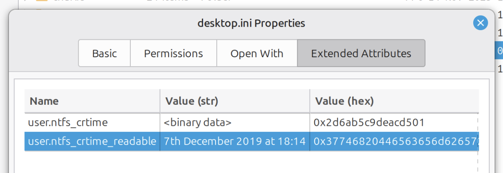

# ntfs2xattr
A couple of scripts to make the process of moving from Windows to Linux just a little bit easier. 💻 🤝 🐧

`ntfs2xattr.py` copies a directory from an NTFS-formatted volume to ext4 while preserving the crtime (NTFS-only) by adding it as an extended attribute to each file. It actually adds two xattrs:
* `user.ntfs_crtime`: the raw NTFS timestamp, defined as the number of 100-nanosecond intervals since 00:00 January 1, 1601 UTC (see https://learn.microsoft.com/en-gb/windows/win32/sysinfo/file-times);
* `user.ntfs_crtime_readable`: a human-readable string representation of that timestamp (e.g. "22nd January 1998").

`nemo-ntfs2xattr.py` is an extension for the [Nemo](https://github.com/linuxmint/nemo) file manager that does two things:
* Adds a new property page called "Extended Attributes" to the file properties window that shows a list of all xattrs on the file;

* Adds a new column to the file browser window called "Date Created (NTFS)" which shows the creation time for each file, read from its xattr.

A debian-based Linux distribution (Ubuntu, Linux Mint, etc.) is assumed for all the instructions in this document; please adjust accordingly for other distros.

## Setup

### Clone the repo
```bash
git clone https://github.com/TriCrose/ntfs2xattr
cd ntfs2xattr
```

### Install the Nemo extension
[`nemo-python`](https://github.com/linuxmint/nemo-extensions/tree/master/nemo-python) is required to use the Nemo extension. You can install it with:
```bash
sudo apt install nemo-python
```
Then create the extensions directory:
```bash
mkdir -p ~/.local/share/nemo-python/extensions
```
Finally, copy over the extension and close any running Nemo instances:
```bash
cp nemo-ntfs2xattr.py ~/.local/share/nemo-python/extensions
chmod +x ~/.local/share/nemo-python/extensions/nemo-ntfs2xattr.py
nemo -q
```

## Usage

### Nemo extension
If you haven't installed the extension already, follow the [steps above](#install-the-nemo-extension).

Once installed, you can view any xattrs a file has via file the "Extended Attributes" page in the file properties window (right-click a file and click "Properties").



You can also add the "Date Created (NTFS)" column to the file browser column headers:


## Tests
### Unit tests
### E2E
